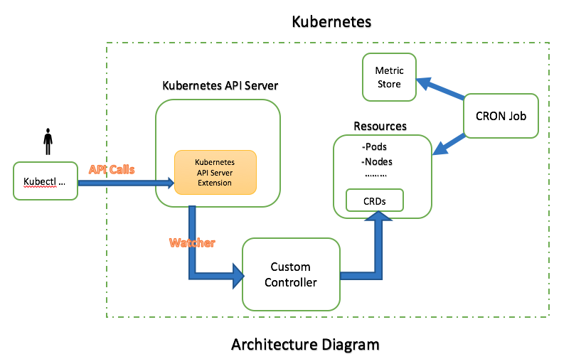

# Architecture of Kuber

The following diagram represents the architecture of Kuber.

The following are the main componenets installed in kubernetes for Kuber.

1. **Kubernetes API Server Extension:**
    
    All the kuber kubectl commands hits the API server extension. These APIs  
    understand the input command and compute and return the required output.

2. **Custom Controller:**
    
    Custom Controller watches for changes in state of pods, nodes, persistent  
    volumes, etc. and update the inventory in CRDs
    
3. **Custom Resource Definitions(CRDs):**
    
    Custom Resource Definitions are like any other resource(Pod, Node, etc.) and  
    stores the config data like ``Group Definitions`` and inventory.

4. **Metric Store:**
    
    Metric store is used to store the utilization, allocation metrics of inventory  
    and also calculated costs.

5. **CRON Job:**
    
    CRON Job collects the stats of inventory and calculates the cost periodically  
    and stores in Metric Store.

# Work Flow

1. User has to install Custom Controller, CRON Job, CRDs in kubernetes.

2. Once installed Custom controller collects all the inventory(pods, nodes, pv, etc.)  
   and stores in CRDs, later it watches for any changes in inventory and stores  
   the changes in CRDs.

3. CRON Job kicks in periodically and collect the stats and stores the stats in  
   metric store. CRON Job also calculates the Costs in the same cycle and stores  
   them in metric store.

4. Any kubectl command invocations are received by Kubernetes API server extension.  
   APIs calculates the required output based on configurations(for groups), inventory,  
   costs metrics and returns to user.
