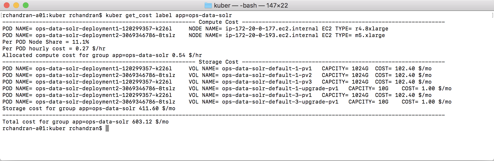

# Kuber plugin for K8s

Cost visbility for Kubernetes based Container Native Applications

## Why?

Today, cost visibility in the world of Container Native Applications is very limited. It is mostly restricted to cost of cloud infrastructure at a
high level and usually involves a lot of manual steps or custom scripting.

Wouldn't it be great if you know the cost of you Kuberentes deployed applications, not matter the cloud of your choice? Don't you wish there was an easy way to
incorporate your budgeting and cost savings at a level of control that was entirely based on application level components rather than infrastructure? 

## What is Kuber

Kuber provides cost visibility of services, microservices and applications deployed with Kubernetes in a cloud neutral manner. It does so at a granular level and
over time ranges that match with budget planning.

Kuber is a CLI extension to Kubernetes. More specifically, it is a ``kubectl`` plugin that helps you query for cost based on native Kubernetes artifacts
as well as your own custom defined services. In addition, kuber allows for alerting on budget adherence and helps enforce budgets and savings.

Kuber currently supports Kubernetes deployments on Amazon Web Services. Support for VMware vSphere, Azure, Google Compute AEngine and other platforms are planned.

## How does it work

Using Kuber is simple and similar to the declarative philosphy adpated by Kubeernetes and kubectl
```
kuber get_cost label app=my-web-ui
```
Would get you the monthly aggregated cost of kubernetes PODs labeled with 'app=my-web-ui'
```
kuber set_limit namespace backend-auto-scaling-group month limit 2400 action alert email backend devops@org.com
```
Would set a monthly limit of 2400$ on resources in the 'backend-auto-scaling-group' and if the cost this group breaches the limit, send an email to devops@org.com
with cost details

## Features

* Query cost associated with Kubernetes native groups
* Extend Kuber with YAML based declarative custom service, microservice and application definitions
* Capability for control over time range for cost query
* Capacbility for cost analysis based on resource Usage or Allocation
* Set budget limits on Kubernetes native or custom defined groups
* Capability to enforce budget and cost saving for Kubernetes native or custom defined groups

## Getting Started

Instructions to install and start using Kuber plugin.

### Prerequisites

You must have ``kubectl`` installed and configured. See [here](https://kubernetes.io/docs/tasks/tools/install-kubectl/)

### Installing

Kuber is currently supported on Linux [Add Flavors and Versions] and OS X. Windows support is currently in development.

1. _Download Kuber [installer](https://fillInURl)_ 
2. _Run kuber_install.sh_

Kuber will install and register as a plugin with the local ``kubectl`` instance. Kuber will automtically be configured to talk to the ``kubectl`` configured clusters

### Usage

```
kuber get_cost label <kubernetes label>
```



## Advanced Usage

### Kuber options

```
kuber {get_cost|set_limit} _options_

get_cost {label|namespace|node-label|name|service|app} <_variable_> {history=<_duration_>[_range_]|projection=<_duration_>} {hourly|daily|weekly|monthly}

set_limit {label|namespace|node-label|name|service|app} <_variable_> {hourly|daily|weekly|monthly} action {email=<_variable_>|hard_enforce|save_enforce}
```

### Defining custom groups

my_service.yaml
```
service:
    name: backend-data-microservice
    label:
        grp=data-pipeline
        rep_set=backend-map-resuce
```

my_app.yaml
```
 app:
     name: my_application
     namespace:
         elastic-loadbalancers
         api-gateway
     label:
         grp=web-portal
         grp=admin-portal
     service:
         backend-data-microservice
```
         


